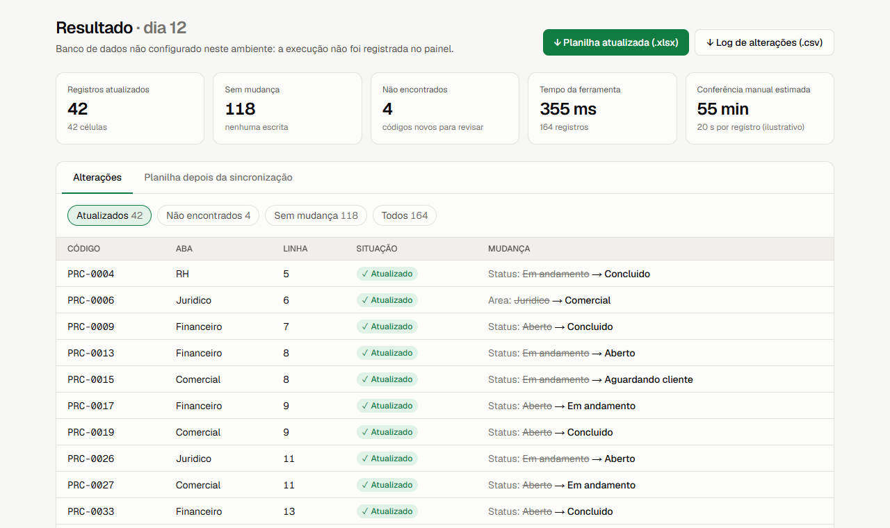
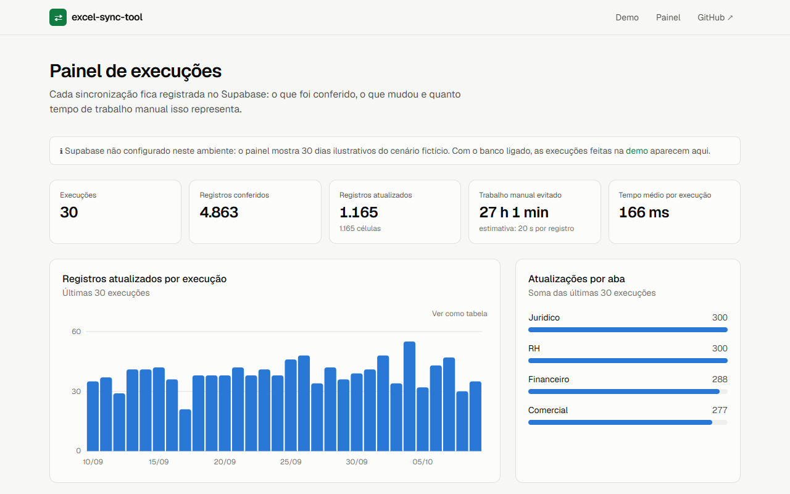
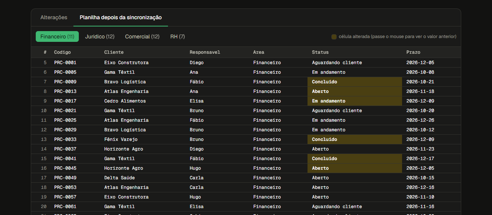

# excel-sync-tool

[](https://github.com/PabloHoDev/excel-sync-tool/actions/workflows/python.yml)
[](https://github.com/PabloHoDev/excel-sync-tool/actions/workflows/web.yml)


Sincroniza automaticamente a **exportação diária de um sistema** (CSV ou
Excel) com uma **planilha de controle de várias abas**: encontra cada
registro na aba certa, atualiza só as células que mudaram e gera um log
auditável. A formatação e a proteção das abas continuam intactas.

O projeto tem duas partes que usam o mesmo algoritmo:

| | Para quê | Stack |
|---|---|---|
| **CLI** (`src/excel_sync`) | Rodar todo dia, agendado, sem abrir o Excel | Python · openpyxl · pytest |
| **Demo web** (`web/`) | Ver a ferramenta funcionando num cenário com números ilustrativos | Node.js · Next.js · Supabase · Vercel |



## O problema

Times que vivem em planilhas de controle (backlog, processos, chamados,
obrigações) recebem todo dia um relatório "oficial" de outro sistema. A
planilha não pode simplesmente ser substituída, porque tem uma aba por
equipe, formatação, comentários e às vezes proteção por senha. Então alguém
confere linha por linha.

No cenário da demo (uma empresa fictícia com **160 processos em 4 abas**),
essa conferência leva **cerca de 55 minutos por dia**, considerando 20
segundos por registro. A ferramenta faz o mesmo em **menos de 1 segundo** e
mostra exatamente o que mudou.

## Como funciona

1. Lê os registros da fonte (CSV ou `.xlsx`).
2. Monta, **uma única vez**, um índice `chave → (aba, linha)` com todas as
   abas válidas. Cada busca passa a ser O(1).
3. Para cada registro, compara as colunas configuradas e escreve **só** as
   células cujo valor mudou. Valor vazio na fonte não apaga o controle.
4. Abas protegidas continuam protegidas; abas de resumo podem ser ignoradas.
5. Gera um log CSV com aba, linha, valor antigo → novo e os códigos não
   encontrados.

Nenhuma regra de negócio fica no código: colunas, linha do cabeçalho, abas
ignoradas e senha vêm de configuração.

## CLI (Python)

```bash
python -m venv .venv
source .venv/bin/activate        # Windows: .venv\Scripts\activate
pip install -e ".[dev]"

python examples/generate_example.py        # cria um cenário de exemplo
excel-sync --config examples/config.yaml
```

```
Resumo da sincronização
------------------------
Atualizados:      33
Sem mudança:      127
Não encontrados:  3
Total processado: 163
```

Também dá para passar tudo por argumento:

```bash
excel-sync --source exportacao.csv --target controle.xlsx \
  --key "Codigo" --update "Area" "Status" \
  --header-row 4 --ignore-sheets "VISAO GERAL" --log log.csv
```

Para rodar todo dia: cron (Linux/macOS), Agendador de Tarefas (Windows) ou
GitHub Actions com runner self-hosted. Veja [`config.example.yaml`](config.example.yaml)
e [`examples/`](examples/).

## Demo web (Node.js + Supabase + Vercel)

A pasta [`web/`](web/) traz uma aplicação Next.js com três telas:

- **Demo:** simula um dia de operação (ou processa os seus arquivos), destaca
  cada célula alterada e permite baixar a planilha atualizada e o log.
- **Painel:** histórico das execuções gravado no Supabase, com volume
  conferido, atualizações por aba e tempo manual evitado.
- **Apresentação:** o problema, a solução e as garantias.

| Painel de execuções | Prévia da planilha (tema escuro) |
|---|---|
|  |  |

Decisões de arquitetura, segurança (RLS, secret key só no servidor,
arquivos enviados nunca armazenados) e o passo a passo de deploy estão em
[`web/README.md`](web/README.md).

## Qualidade

- **Testes:** pytest (motor e CLI, ~94% de cobertura) e Vitest (motor
  TypeScript), com os mesmos casos nas duas versões: atualização parcial, aba
  ignorada, chave duplicada, chave vazia, cabeçalho deslocado e preservação de
  formatação e proteção depois de salvar.
- **CI:** GitHub Actions roda lint (ruff / ESLint), formatação, tipos, testes
  e build em cada push e pull request. A CLI é testada em Linux e Windows,
  com Python 3.10 a 3.13.

```bash
pytest --cov=excel_sync                       # Python
cd web && npm test && npm run build           # Web
```

## Limitações conhecidas

- **Gráficos e imagens embutidas** são descartados ao regravar o arquivo
  (limitação do openpyxl e do exceljs). Estilos, larguras, mesclagens e
  proteção são preservados.
- Se a mesma chave aparecer em mais de uma aba, vale a primeira ocorrência e
  a CLI registra um aviso.
- Quando a **Área** de um registro muda, a célula é atualizada, mas a linha
  continua na aba original (a ferramenta não move linhas entre abas).

## Estrutura

```
excel-sync-tool/
├── src/excel_sync/          # motor e CLI em Python
├── tests/                   # pytest
├── examples/                # cenário reproduzível + config
├── web/                     # demo Next.js (motor TS, API, telas, Supabase)
│   ├── src/lib/engine/      # motor de sincronização em TypeScript + testes
│   ├── src/app/             # páginas e Route Handlers
│   └── supabase/            # migration e seed
├── docs/images/             # capturas de tela
└── .github/workflows/       # CI Python e Web
```

## Fluxo de trabalho

- `main`: versões publicadas, marcadas com tags (`v1.0.0`, `v1.1.0`, `v2.0.0`).
- `develop`: integração.
- `feature/*`, `fix/*`, `perf/*`, `chore/*`, `docs/*`: uma branch por
  assunto, integrada com merge `--no-ff` para o histórico mostrar cada
  entrega.
- Commits no padrão [Conventional Commits](https://www.conventionalcommits.org/pt-br/).
  Histórico de versões em [`CHANGELOG.md`](CHANGELOG.md).

## Origem

O projeto nasceu de uma automação real feita em VBA para manter uma planilha
de controle sincronizada com uma base exportada diariamente. A lógica foi
reescrita do zero em Python, generalizada (sem colunas ou regras de um
negócio específico), coberta por testes e depois portada para TypeScript
para a demo web.

## Licença

[MIT](LICENSE) © Pablo Oliveira
